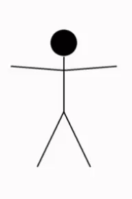

# android-animated-stick-view

val paint = Paint().also {
            it.color = getColor(R.color.black)
            it.strokeWidth = 5f
        }

        val scene = Scene().also {
            it.simples.add(Line(PointF(4F,5F), PointF(6F,5F), paint,"line"))
        }

        val scene2 = SceneUtil.move(scene.getCopy(), -2F, SceneUtil.TargetAxis.Y)

        val sceneCollection = SceneCollection().also {
            it.scenes.add(scene)
            it.scenes.add(scene2)
        }

        findViewById<StickView>(R.id.stick_view).let {
            it.setVerticalLinesCount(10)
            it.enableDynamicHorizontalLinesCount(true)
            it.setSceneCollection(sceneCollection)
            it.startAnimation()
        }

        val scene = Scene().also {
            it.simples.add(Circle(PointF(4F,3.5F), 0.5F, paint,"head"))
            it.simples.add(Line(PointF(4F,4F), PointF(4F,4.5F), paint,"neck"))
            it.simples.add(Line(PointF(4F,4.5F), PointF(6F,4F), paint,"right_arm"))
            it.simples.add(Line(PointF(4F,4.5F), PointF(2F,4F), paint,"left_arm"))
            it.simples.add(Line(PointF(4F,4.5F), PointF(4F,6F), paint,"body"))
            it.simples.add(Line(PointF(4F,6F), PointF(5F,8F), paint,"right_food"))
            it.simples.add(Line(PointF(4F,6F), PointF(3F,8F), paint,"left_food"))
        }

        val scene2= Scene().also {
            it.simples.add(Line(PointF(4F,4.5F), PointF(6F,5F), paint,"right_arm"))
            it.simples.add(Line(PointF(4F,4.5F), PointF(2F,5F), paint,"left_arm"))
        }

        val scene3= Scene().also {
            it.simples.add(Line(PointF(4F,4.5F), PointF(6F,4F), paint,"right_arm"))
            it.simples.add(Line(PointF(4F,4.5F), PointF(2F,4F), paint,"left_arm"))
        }

        val sceneCollection = SceneCollection().also {
            it.scenes.add(scene)
            it.scenes.add(scene2)
            it.scenes.add(scene3)
        }

        findViewById<StickView>(R.id.stick_view).let {
            it.setVerticalLinesCount(10)
            it.enableDynamicHorizontalLinesCount(true)
            it.setSceneCollection(sceneCollection)
            it.setAnimationDuration(1000)
            it.startAnimation()
        }

